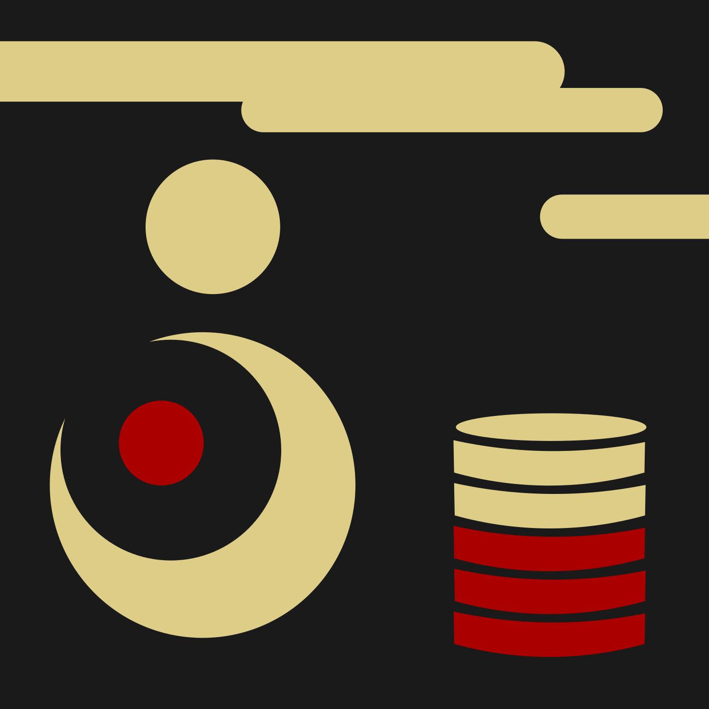
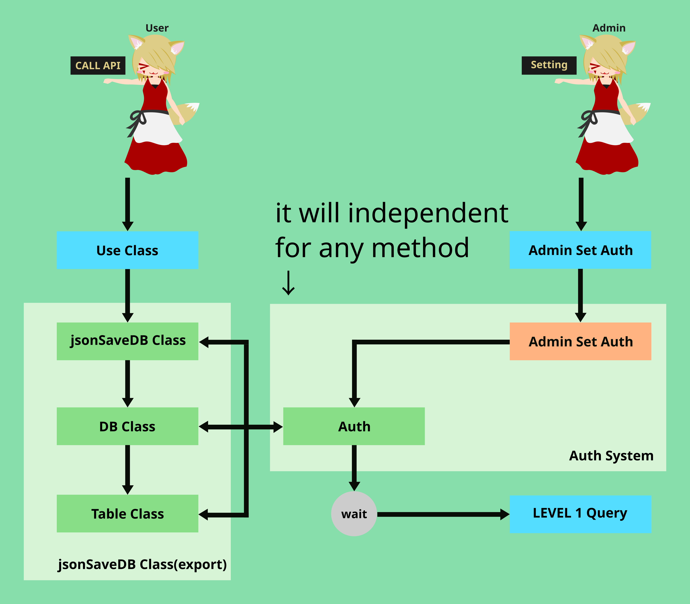
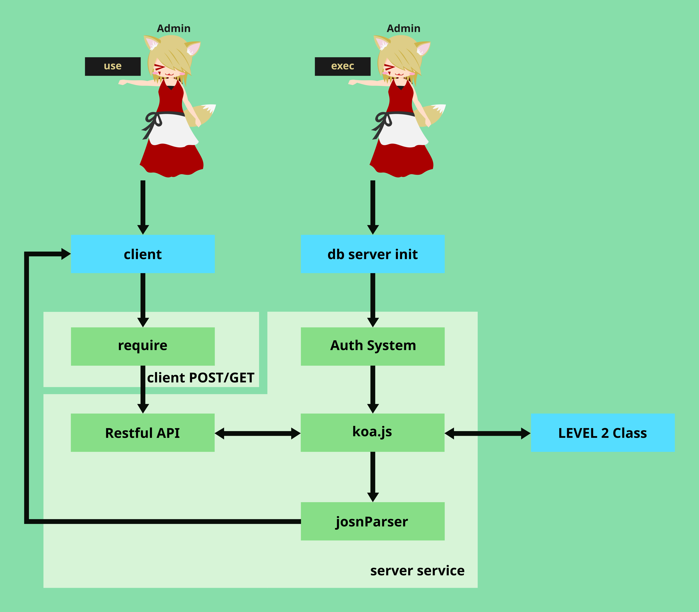
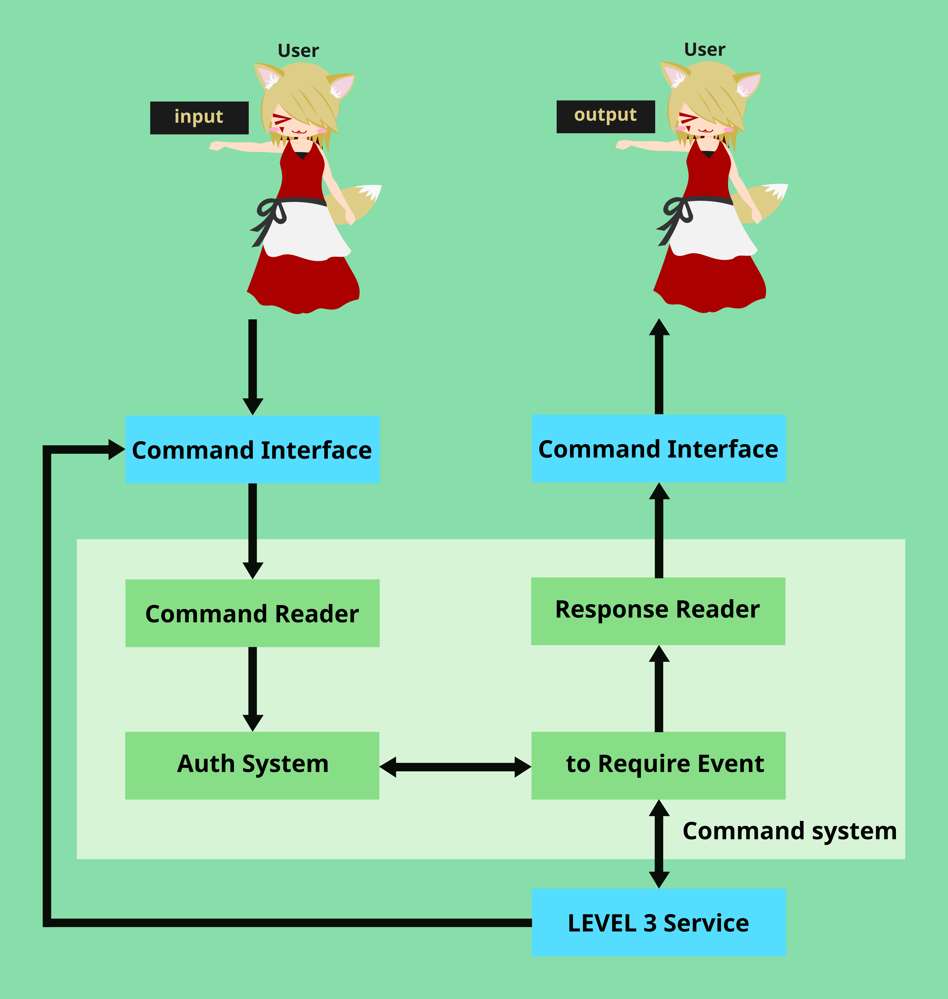
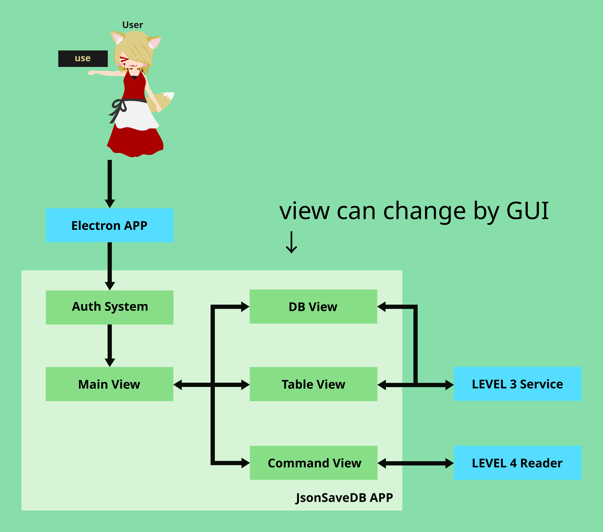

# jsonSaveDB

<center>
    
    <div>jsonSaveDB</div><br>
</center>

## 設計目的
* 之前有碰過mongodb，雖然滿喜歡那種json儲存的資料庫，且能方便安裝執行，但由於mongodb的授權比較麻煩，所以實務上也沒機會用到，於是我就決定寫一個用自己的角度去用json儲存的資料庫
* 在此為了js-galgame計畫，所以要實現100% JavaScript的實現，而設計的儲存資料庫，當然初步版本，未包含加密與平行執行的實現。

## 開發備忘錄
* 一個輕量化取代以json與系統查詢建立的資料庫方案
* 主要以json為資料儲存
* NoSQL的儲存模式
* 使用外部排序處理(基本高等資結所提的技術)
* 部份平行化執行模組
* 自動備份機制
* 單資料庫限時驗證機制
* 鎖定執行機制
* 運用排程系統實現多平行處理

## 開發規則
* 版本規則：
    * 範例：
    ```
    A.B.C [Name] - XXXX

    A      : 主版本編號，除了初版正式版本1.0.0外，異動原因為整體架構級或是程式語言的重大改版。
    B      : 版本演進編號，為大幅度功能上的演進識別編號。
    C      : 緊急修復版本編號，在此為緊急修復後的辨識編號。
    [Name] : 對應版本演進號的發行名稱。
    XXXX   : 發行的類型，如：alpha、beta等...，正式版本無此描述。
    ```

* 版本演進：
    1. alpha版本： 未進行白箱測試，理論上是會有很多bug的情況，但以完成程式的版本
    2. btea版本： 已完成白箱測試，並對於Bug進行修復，但文件尚未完成的發佈版本。
    3. 正式發佈版本：已完成測試且有文件的正式版本
    4. 緊急修復版本：有Bug的修復版本。

## 簡單的架構說明：
在此將架構分成五層，由下至上以Level1~Level5表示，每層架構都有其意義，且能視專案拆開使用：

### Level1：
底層直接資料庫操作API，具有簡單的排程系統。我們能直接設定資料庫內部process來進行資料庫控制，但是屬於偏向未整合的破碎模組控制，其method部份可配合實際應用行為自行拆裝使用。

<center>
    
    <div>第1層架構</div><br>
</center>

* serviceCheck: 服務確認用模組。
    * checkPath: 確認設定檔路徑與實現自動修正與調整。
    * reLifeConfig: 認設定檔資料與建構設定。
    
* reLifeService: 修補系統中斷後重啟的復原工作態之模組，若排程系統使用redis將自動跳過。
    * checkLocker: 檢查是否有中斷時未執行的排程做自動檢查的操作。
    * reLifeProcess: 將中斷操作修復，回歸至可執行的排程狀態。

* resourcesLocker：資源鎖定器，負責掌管著從使用者新增的資料庫操作排程行程的生命週期。
    * setQueryToProcess：使用者新增的所有資料庫操作轉成process，並送至排程器上。
    * lockerSystem：讀取process，並建立資源鎖定事件，若有衝突，該將process將返回排程器，且提升排程優先等級。
    * execSystem: 將鎖定後資源的行程進行實際執行，該系統將會進行操作外也會以execLimit作為錯誤後重新執行的機制。
    * unocker：解鎖器，當執行完成後，將資源重新釋放，並撤銷processID。

* ProcessSystem：實際處理process的處理系統，初步是以純js進行開發，未來將提供可置換的redis模組。
    * processQueue：實際儲存process的順序處，在此提供三個主要優先序：frist、base、last三個等級。
* methods: 實際執行的功能模組。
    * oneThreadMethod: 不會調用多執行序實現平行化處理的模組。
    * multThreadMethod: 以平行化處理操作的模組，以此減少執行時間。

* worker: 在此的實現平行化處理是使用worker進行實現。
    * worker model：實際切割後的可平行化執行的資料庫操作程式碼。


### Level2：
將Level1的功能使用class封裝，這也意謂著我們將不必直接呼叫排程器或是內部模組進行執行，我們將能使用class的物件導向關係去做資料庫操作的控制。

<center>
    
    <div>第2層架構</div><br>
</center>

* jsonSaveDB: 具有物件導向封裝的資料庫操作界面。
    * jsonSaveDBClass: 整體資料庫控制用Class。 
    * databaseClass:  對於選擇的資料庫使用的Class。
    * tableClass: 對於選擇的資料table(含產生的回傳資料用的table)使用的Class。

* authSystem處理使用者管理的功能。
    * auth: 管理驗證核心，實際管理使用者的驗證與分離管理員管理。
    * adminSetAuth: 管理員設定用界面。


### Level3：
使用koa.js將Level2的功能服務化，這時我們就能在client端以Restful API的方式對Server端進行第二層進行操作，而在安全上也可以對於控制進行保護或是刪去，以避免越權操作導致直接破壞資料庫的情況發生。

<center>
    
    <div>第3層架構</div><br>
</center>

* clienPostGet: 使用者端發出的請求，可以是post或是get。
    * require: 發出的請求的程式碼。

* serverService: 伺服器端。
    * authSystem: 伺服器端使用者初始化系統時，啟動的驗證確認。
    * koa.js: 主要的服務器將請求轉成向Level2的操作。
    * resfulAPI: 實際的路由管理，採用restfulAPI設計。
    * jsonParser: 將錯誤與取得的資料轉成json，並進行返回。


### Level4：
使用指令解析器，處理輸入的指令，並將其轉成對應Level3的client端發送的require請求。

<center>
    
    <div>第4層架構</div><br>
</center>

* commandSystem: 主要的輸入管理系統(純CLI環境執行)，server可以是local server。
    * commandReader: 輸入指令的解讀器，將指令解析為對應功能。
    * authSystem: 驗證機制，處理該用戶使用此輸入的用戶驗證。
    * toReuqireEvent: 將以轉換對應功能的指令，包成客戶端請求。
    * responseReader: 將server端的返回結果輸出至終端上。


### Level5：
結合Level3與Level4的控制(雖然程式碼增加，但因為操作的不同運算時間，所以只有一部份是調用Level4，其餘是使用Level3實現)。

<center>
    
    <div>第5層架構</div><br>
</center>

* jsonSaveDB APP:封裝成GUI界面的應用。
    * authSystem: 驗證用戶用模組。
    * mainView: 主要管理界面與其相關操作管理模組。
    * dbView: 資料庫管理界面與其相關操作管理模組，僅需調用Level3。
    * tableView: 表格界面與其相關操作管理模組，僅需調用Level3。
    * commandView: 指令化的操作界面與其相關操作管理模組，需要調用Level4。

## 開發稽核點
* 0.1.0 [預計]
    * 目標完成功能：資料庫核心、日誌寫檔控制、日程格式處理、資料庫操控函式庫建立與測試、安裝系統設定。

* 0.2.0 [預計]
    * 目標完成功能：用戶驗證系統、平行化執行。

* 1.0.0 [預計]
    * 目標完成功能：資料庫能正常使用，並發行至npm庫。

